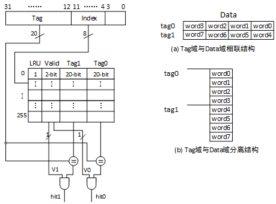
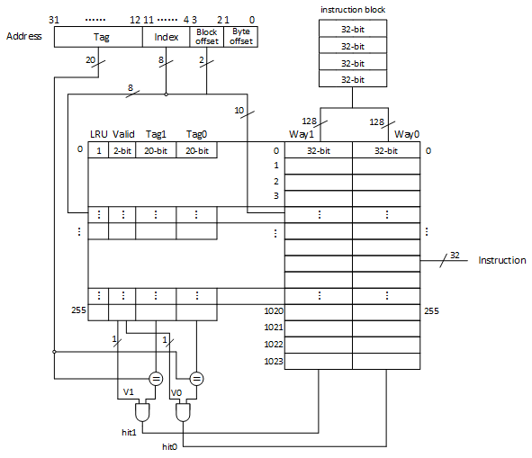
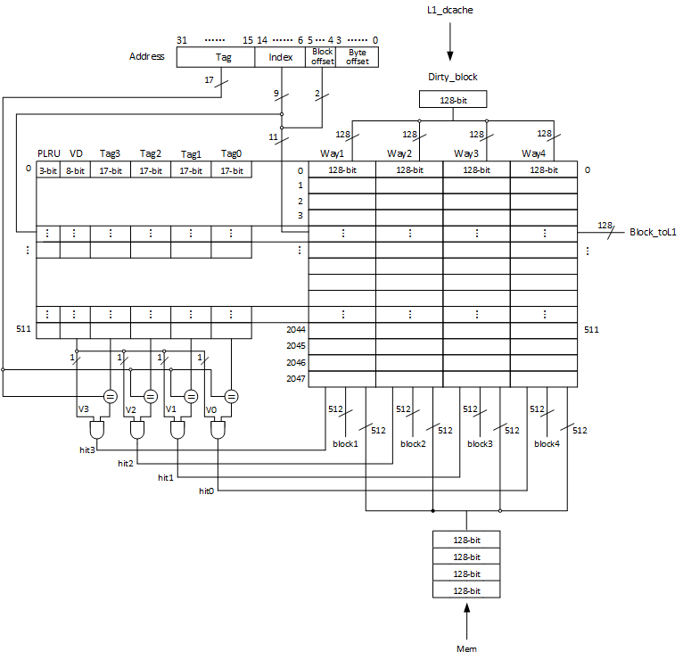

# Icache 设计与实现

对于  cache_ram 中 tag 和 data 设计的关系设计，如图 1-1。

## **Icache 设计**

表 1-1 列出了 Icache 的模块一览。

| 模块名     | 文件名       |  说明                |
| :----      | :----        | :----                |
| icache_ctrl     | icache_ctrl.v     | L1_icache 的控制模块|
| L2_cache_ctrl  | L2_cache_ctrl.v  | L2_cache 的控制模块|
| tag_ram    | tag_ram.v    | tag_ram of L1_icache |
| data_ram   | data_ram.v   | data_ram of L1_icache|
| L2_tag_ram | L2_tag_ram.v | tag_ram of L2_cache |
| L2_data_ram| L2_data_ram.v| data_ram of L2_cache|
|sram_256    |sram_256.v    | sram of L1_icache|
|sram_512    |sram_512.v    | sram of L2_icache|

## **L1_icache**
### L1_icache 控制模块的输入输出端口
一级指令 cache（icache_ctrl）的信号线一览如表 1-2 所示。

| 信号名   	|  信号类型 | 数据类|位宽	|含义			|
| :----  	| :----  	| :---- |:----|:----  		|
|clk		|输入端口	|wire	|1	|时钟			|
|rst		|输入端口	|wire	|1	|复位		|
|if_addr	|输入端口	|wire	|32	|IF 阶段指令地址|
|rw		    |输入端口	|wire	|1	|IF 阶段 CPU 读写信号|
|cpu_data	|输出端口	|reg	|32	|CPU 读取的指令|
|miss_stall	|输出端口	|reg	|1  |L1_cache 缺失引起的停顿信号|
|lru	    |输入端口	|wire	|1	|L1_cache 替换的块号|
|tag0_rd	|输入端口	|wire	|21	|tag0 的读数据|
|tag1_rd	|输入端口	|wire	|21	|tag1 的读数据|
|data0_rd 	|输入端口	|wire	|128|data0 的读数据|
|data1_rd   |输入端口	|wire	|128|data1 的读数据|
|tag0_rw 	|输出端口	|reg	|1	|tag0 的读写信号|
|tag1_rw   	|输出端口	|reg	|1	|tag1 的读写信号|
|tag_wd 	|输出端口	|wire	|21	|tag 的写数据|
|data0_rw   |输出端口	|reg	|1	|data0 的读写信号|
|data1_rw 	|输出端口	|reg	|1	|data1 的读写信号|
|index   	|输出端口	|wire	|8	|L1_icache 的地址|
|L2_busy   	|输入端口	|wire	|1	|L2_cache 的忙碌信号|
|L2_rdy 	|输入端口	|wire	|1	|L2_cache 的准备信号|
|complete   |输入端口	|wire	|1	|写入 L1 的完成信号|
|irq   	    |输出端口	|reg	|1	|指令 cache 缺失引起的请求信号|

### sram_256 模块的输入输出端口
sram_256 (sram_256) 的信号线一览如表 1-2 所示。

| 信号名   	|  信号类型 | 数据类|位宽	|含义			|
| :----  	| :----  	| :---- |:----|:----  		|
|clk		|输入端口	|wire	|1	|时钟			|
|a 	|输入端口	|wire	|8	|L1_icache 的地址|
|wr   	|输入端口	|wire	|1	|L1_icache 的读写信号|
|rd   	|输入端口	|wire 	|WIDTH	|自定义长度的的读数据|
|wd 	|输入端口	|wire	|WIDTH	|自定义长度的的写数据|

### icache_tag 模块的输入输出端口
icache_tag (tag_ram) 的信号线一览如表 1-2 所示。

| 信号名   	|  信号类型 | 数据类|位宽	|含义			|
| :----  	| :----  	| :---- |:----|:----  		|
|clk		|输入端口	|wire	|1	|时钟			|
|tag0_rw 	|输入端口	|wire	|1	|tag0 的读写信号|
|tag1_rw   	|输入端口	|wire	|1	|tag1 的读写信号|
|index   	|输入端口	|wire 	|8	|L1_icache 的地址|
|tag_wd 	|输入端口	|wire	|21	|tag 的写数据|
|tag0_rd	|输出端口	|wire	|21	|tag0 的读数据|
|tag1_rd	|输出端口	|wire	|21	|tag1 的读数据|
|LRU	    |输出端口	|wire	|1	|L1_cache 替换的块号|
|complete   |输出端口	|reg	|1	|写入 L1 的完成信号|

### icache_data 模块的输入输出端口
icache_data (data_ram) 的信号线一览如表 1-3 所示。

| 信号名   	|  信号类型 | 数据类|位宽	|含义			|
| :----  	| :----  	| :---- |:----|:----  		|
|clk		|输入端口	|wire	|1	|时钟			|
|data0_rw   |输入端口	|wire	|1	|data0 的读写信号|
|data1_rw 	|输入端口	|wire	|1	|data1 的读写信号|
|index   	|输入端口	|wire	|8	|L1_icache 的地址|
|data_wd 	|输入端口	|wire	|128|data 的写数据|
|data0_rd 	|输出端口	|wire	|128|data0 的读数据|
|data1_rd   |输出端口	|wire	|128|data1 的读数据|

###L1_icache 的示意图

L1_icache 的结构示意图，如图 1-2 所示。

##**L2_cache**
### L2_cache 控制模块的输入输出端口
二级 cache 控制模块（L2_cache_ctrl）的信号线一览如表 1-4 所示。

| 信号名   	|  信号类型 | 数据类|位宽	|含义			|
| :----  	| :----  	| :---- |:----|:----  		|
|clk		|输入端口	|wire	|1	|时钟			|
|rst		|输入端口	|wire	|1	|复位		|
|if_addr	|输入端口	|wire	|32	|IF 阶段指令地址|
|rw		    |输入端口	|wire	|1	|IF 阶段 CPU 读写信号|
|L2_miss_stall	|输出端口	|reg	|1  |L2_cache 缺失引起的停顿信号|
|irq   	    |输入端口	|wire	|1	|指令 cache 缺失引起的请求信号|
|complete   |输入端口	|wire	|1	|写入 L1 的完成信号|
|L2_complete   |输入端口	|wire	|1	|写入 L2 的完成信号|
|plru	    |输入端口	|wire	|3	|L2_cache 替换算法的信号|
|plru_now	|输出端口	|reg	|3	|当前的 plru 值|
|L2_tag0_rd	|输入端口	|wire	|19	|L2_tag0 的读数据|
|L2_tag1_rd	|输入端口	|wire	|19	|L2_tag1 的读数据|
|L2_tag2_rd	|输入端口	|wire	|19	|L2_tag2 的读数据|
|L2_tag3_rd	|输入端口	|wire	|19	|L2_tag3 的读数据|
|L2_busy   	|输出端口	|reg	|1	|L2_cache 的忙碌信号|
|L2_data0_rd 	|输入端口	|wire	|512|L2_data0 的读数据|
|L2_data1_rd   |输入端口	|wire	|512|L2_data1 的读数据|
|L2_data2_rd 	|输入端口	|wire	|512|L2_data2 的读数据|
|L2_data3_rd   |输入端口	|wire	|512|L2_data3 的读数据|
|data_wd 	|输出端口	|reg	|128	|data 的写数据|
|L2_tag0_rw 	|输出端口	|reg	|1	|L2_tag0 的读写信号|
|L2_tag1_rw   	|输出端口	|reg	|1	|L2_tag1 的读写信号|
|L2_tag2_rw 	|输出端口	|reg	|1	|L2_tag2 的读写信号|
|L2_tag3_rw   	|输出端口	|reg	|1	|L2_tag3 的读写信号|
|L2_tag_wd 	|输出端口	|wire	|19	|L2_tag 的写数据|
|L2_rdy 	|输出端口	|reg	|1	|L2_cache 的准备信号|
|L2_data0_rw   |输出端口	|reg	|1	|L2_data0 的读写信号|
|L2_data1_rw 	|输出端口	|reg	|1	|L2_data1 的读写信号|
|L2_data2_rw   |输出端口	|reg	|1	|L2_data2 的读写信号|
|L2_data3_rw 	|输出端口	|reg	|1	|L2_data3 的读写信号|
|L2_index   	|输出端口	|wire	|8	|L2_cache 的地址|

### sram_512 模块的输入输出端口
sram_512 (sram_512) 的信号线一览如表 1-2 所示。

| 信号名   	|  信号类型 | 数据类|位宽	|含义			|
| :----  	| :----  	| :---- |:----|:----  		|
|clk		|输入端口	|wire	|1	|时钟			|
|a 	|输入端口	|wire	|8	|L2_icache 的地址|
|wr   	|输入端口	|wire	|1	|L2_icache 的读写信号|
|rd   	|输入端口	|wire 	|WIDTH	|自定义长度的的读数据|
|wd 	|输入端口	|wire	|WIDTH	|自定义长度的的写数据|

### L2_cache_tag 模块的输入输出端口
L2_cache_tag (L2_tag_ram) 的信号线一览如表 1-5 所示。

| 信号名   	|  信号类型 | 数据类|位宽	|含义			|
| :----  	| :----  	| :---- |:----|:----  		|
|clk		|输入端口	|wire	|1	|时钟			|
|L2_tag0_rw 	|输入端口	|wire	|1	|L2_tag0 的读写信号|
|L2_tag1_rw   	|输入端口	|wire	|1	|L2_tag1 的读写信号|
|L2_tag2_rw 	|输入端口	|wire	|1	|L2_tag2 的读写信号|
|L2_tag3_rw   	|输入端口	|wire	|1	|L2_tag3 的读写信号|
|L2_index   	|输入端口	|wire	|8	|L2_cache 的地址|
|plru_now	|输入端口	|wire	|3	|当前的 plru 值|
|L2_tag_wd 	|输入端口	|wire	|19	|L2_tag 的写数据|
|L2_tag0_rd	|输出端口	|wire	|19	|L2_tag0 的读数据|
|L2_tag1_rd	|输出端口	|wire	|19	|L2_tag1 的读数据|
|L2_tag2_rd	|输出端口	|wire	|19	|L2_tag2 的读数据|
|L2_tag3_rd	|输出端口	|wire	|19	|L2_tag3 的读数据|
|plru	    |输出端口	|wire	|3	|L2_cache 替换算法的信号|
|L2_complete   |输出端口|reg	|1	|写入 L2 的完成信号|

### L2_cache_data 模块的输入输出端口
L2_cache_data (L2_data_ram) 的信号线一览如表 1-6 所示。

| 信号名   	|  信号类型 | 数据类|位宽	|含义			|
| :----  	| :----  	| :---- |:----|:----  		|
|clk		|输入端口	|wire	|1	|时钟			|
|L2_data0_rw   |输入端口	|wire	|1	|L2_data0 的读写信号|
|L2_data1_rw 	|输入端口	|wire	|1	|L2_data1 的读写信号|
|L2_data2_rw   |输入端口	|wire	|1	|L2_data2 的读写信号|
|L2_data3_rw 	|输入端口	|wire	|1	|L2_data3 的读写信号|
|L2_index   	|输入端口	|wire	|8	|L2_cache 的地址|
|L2_data_wd   |输入端口	|wire	|512|L2_data 的写数据|
|L2_data0_rd   |输出端口	|wire	|512|L2_data0 的读数据|
|L2_data1_rd   |输出端口	|wire	|512|L2_data1 的读数据|
|L2_data2_rd 	|输出端口	|wire	|512|L2_data2 的读数据|
|L2_data3_rd   |输出端口	|wire	|512|L2_data3 的读数据|

###L2_cache 的示意图

L2_cache 的结构示意图，如图 1-3 所示。

