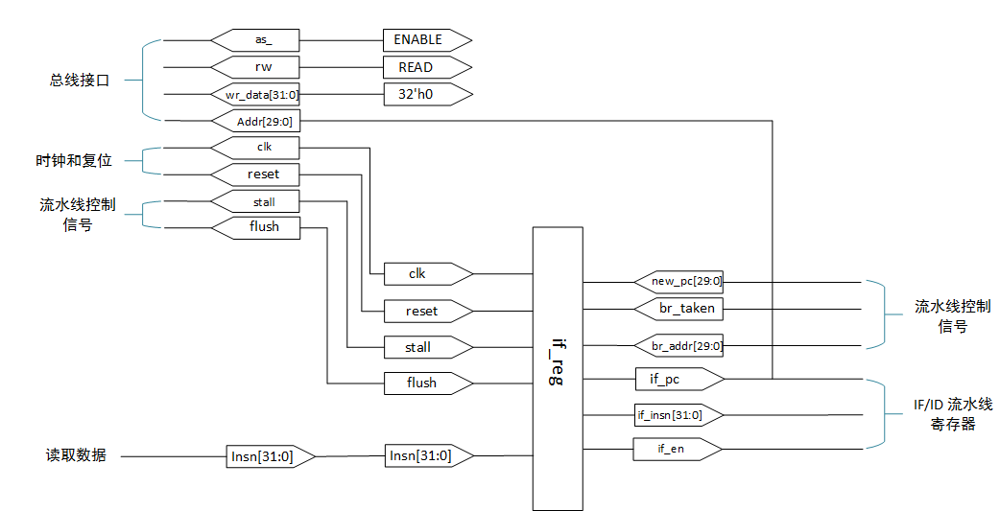

# Instruction Fetch（IF）阶段设计与实现

## **IF 阶段**

IF 阶段主要负责取指令，并决定下一条 PC 寄存器的内容。 IF 阶段由流水线寄存器与总线接口组成。表 1-1 列出了 IF 阶段的模块一览。

| 模块名   | 文件名   	|  说明  	      |
| :----    | :----  	| :---- 	      |
| if_stage | if_stage.v | IF  阶段顶层模块    |
| if_reg   | if_reg.v   | IF 阶段流水线寄存器 |
| bus_if   | bus_if.v   | 总线接口            |
IF 阶段的模块关系图如图 1-1。


## **IF 阶段的流水线寄存器**
### IF 阶段流水线寄存器输入输出端口
IF 阶段的流水线寄存器（if_reg）的信号线一览如表 1-2 所示。

| 分组        	  | 信号名   	|  信号类型  	| 数据类|位宽	|含义			|
| :---- 	  | :----  	| :----  	| :---- | :---- | :----  		|
|时钟		  |clk		|输入端口	|wire	|1	|时钟			|
|复位		  |reset	|输入端口	|wire	|1	|异步复位		|
|读取数据	  |insn		|输入端口	|wire	|32	|读取的指令		|
|流水线控制信号	  |stall	|输入端口	|wire	|1	|延迟			|
|流水线控制信号	  |flush	|输入端口	|wire	|1	|刷新			|
|流水线控制信号	  |new_pc	|输入端口	|wire	|32	|新程序计数器值		|
|流水线控制信号	  |br_taken	|输入端口	|wire	|1	|分支发生		|
|流水线控制信号	  |br_addr	|输入端口	|wire	|32	|分支目标地址		|
|IF/ID流水线寄存器|if_pc	|输出端口	|reg	|32	|程序计数器		|
|IF/ID流水线寄存器|if_insn 	|输出端口	|reg	|32	|指令			|
|IF/ID流水线寄存器|if_en   	|输入端口	|reg	|1	|流水线数据有效标志位	|


###IF 阶段流水线寄存器端口连接图

故 IF 阶段的顶层模块的连接图如图 1-2 所示。



IF 阶段的流水线寄存器（if_reg）的程序如下所示。
```python
always @(posedge clk)
    begin
          if (reset == `ENABLE_)
              begin
    /********************异步复位********************/
                  if_pc <= #1 `WORD_DATA_W'b0;          // 初始化PC为全零
                  if_insn <= #1 `ISA_NOP;               // 初始化指令为空
                  if_en <= #1 `DISABLE;                 // 初始化取指使能位为无效
              end
          else
            begin
    /*************更新流水线寄存器***************/
                if (stall == `DISABLE)
                    begin
                      if (flush == `ENABLE)                
                          /************* 刷新 ***************/
                          begin
                              if_pc <= #1 new_pc;       // 更新 PC 为新程序计数器值
                              if_insn <= #1 `ISA_NOP;   // 设置读取的指令为空
                              if_en <= #1 `DISABLE;     // 设置取指使能位为无效
                          end 
                      else if (br_taken == `ENABLE)
                          /************* 分支成立 ***************/
                          begin 
                              if_pc <= #1 br_addr;      // 更新 PC 为分支目标地址
                              if_insn <= #1 insn;       // 设置对应地址的指令为读取的指令
                              if_en <= #1 `ENABLE;      // 设置取指使能位为有效
                         end
                      else                                     
                          /************ 下一条地址 **************/
                          begin
                              if_pc <= #1 if_pc + `WORD_DATA_W'd4;// 更新 PC 为下一条地址
                              if_insn <= #1 insn;       // 设置对应地址的指令为读取的指令
                              if_en <= #1 `ENABLE;      // 设置取指使能位为有效
                          end
                    end
        end
    end
```
###**Testbench**

####流水线刷新
**输入信号**

|insn	| stall   	| flush 	| new_pc | br_taken 	| br_addr|
| :----	| :---- 	| :----  	| :----  | :----  	| :----  |
|0x124	| DISABLE	| ENABLE	|  0x154 |DISABLE 	|0x100	 |
**输出信号**

| if_pc  | if_insn    |if_en	| 
| :----	 | :----      |:----  	|
| 0x154  | ISA_NOP    |DISABLE	|

####分支成立
**输入信号**

|insn	| stall   	| flush 	| new_pc | br_taken 	| br_addr|
| :----	| :---- 	| :----  	| :----  | :----  	| :----  |
|0x124	| DISABLE 	| DISABL	|0x154 	 | ENABLE   	|0x100   |
**输出信号**

| if_pc  | if_insn  |if_en	| 
| :----  | :----    | :----  	|
| 0x100  | ins	    |ENABLE 	|

####下一条地址
**输入信号**

|insn  | stall   | flush    | new_pc | br_taken | br_addr|
| :----| :----   | :----    | :----  | :----    | :----  |
|0x124 | DISABLE | DISABLE  |  0x154 | DISABLE  |0x100   |
**输出信号**

| if_pc  | if_insn  |if_en   | 
| :----  | :----    | :----  |
| 0x104  | insn     |ENABLE  |

##**IF 阶段的顶层模块**

IF 阶段的顶层模块用于连接总线接口与 IF 阶段的流水线寄存器。 由于 IF
阶段只进行指令的读取，总线接口的读 / 写信号（rw）设置为读取（READ），写入的数据（wr_data）设置为 0。由于每个时钟周期都会进行指令的读取，持续将地址有效信号（as_）设置为有效（ENABLE_）。

**（目前未实现总线部分，故只考虑 IF 阶段的流水线寄存器）**

