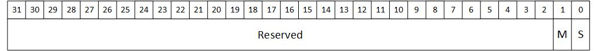

# 定时器

## 什么是定时器

计算机可以利用定时器实现时间测量、周期性处理、超时判断等许多用途。定时器通过软件设置定时的时长并启动，经过设定时间后引发 CPU 中断请求。

##定时器的设计

具有两种动作模式：

- 经过设定时间后向 CPU 请求一次中断即完成操作的单次定时模式；
- 每经过设定时间就向 CPU 请求一次中断的循环定时模式。

CPU 通过访问 I/O 的控制寄存器对 I/O 进行控制。我们这里设计的定时器的控制寄存器的规格如表 1-1 所示。

|寄存器编号 |  说明  |偏移地址|访问类型 |
|:----      | :----  |:----  |:----     |
|0          |控制    |0x0    |读/写     |
|1          |中断    |0x4    |读/写     |
|2          |最大值  |0x8    |读/写     |
|3          |计数器  |0xc    |读/写     |

###控制寄存器 0 :控制寄存器

**[0] :起始位(S)**

该位用来控制定时器的开 / 关。该位为 1 时定时器开始计数。

**[1] :模式位(M)**

该位用来设置定时器的动作模式。该位为 1 时定时器为循环定时模式。

控制寄存器 0 的结构如图 1.1。



###控制寄存器 1 :中断寄存器

**[0] :中断位(I)**

当定时器计数达到设定的最大值时该位变为 1。该位为 1 时向 CPU 发送中断请求。

控制寄存器 1 的结构如图 1.2。


###控制寄存器 2 :最大值寄存器

**[31:0] :最大值(EXPR_VAL)**

该寄存器用来设置计数的最大值。如果计数器累计到与该寄存器的值相等时,
表示定时时间到。

控制寄存器 2 的结构如图 1.3。


### 控制寄存器 3 :计数器寄存器

**[31:0] :计数器(COUNTER)**

该寄存器为定时器的计数器。计时开始后该寄存器的值开始增长。

控制寄存器 3 的结构如图 1.4。


##定时器的实现

这里设计的定时器由一个被称为 timer 的模块构成。该模块由记录经过时间计算机器（COUNTER）、表示定时时间的计数最大值寄存器（EXPR_VAL）、控制定时器启动和动作模式的起始位（S）与模式位（M）以及通知计时完成的中断位（I）构成。

timer 端口连接图如图 1.5。


起始位设为 1时计数开始，计数到达最大值后计数器被初始化，并设置中断位为 1。此时如果模式位为单次定时模式，则会将起始位清零。如果模式为循环定时模式，则自动进入下一个计数周期。

定时器的宏一览如表 1-2 所示。

| 宏名字            |值     |含义               |
| :----             |:----  | :----             |
|TIMER_ADDR_W       |2      |地址宽度           |
|TIMER_ADDR_Bus     |1:0    |地址总线           |
|TIMER_ADDR_LOC     |1:0    |地址的位置         |
|TIMER_ADDR_CTRL    |2'h0   |控制寄存器 0:控制  |
|TIMER_ADDR_INTR    |2'h1   |控制寄存器 1:中断  |
|TIMER_ADDR_EXPR    |2'h2   |控制寄存器 2:最大值|
|TIMER_ADDR_COUNTER |2'h3   |控制寄存器 3:计数器|
|TIMER_START_LOC    |0      |起始位的位置       |
|TIMER_MODE_LOC     |1      |模式位的位置       |
|TIMER_MODE_ONE_SHOT|1'b0   |模式 :单次定时器   |
|TIMER_MODE_PERIODIC|1'b1   |模式 :循环定时器   |
|TIMER_IRQ_LOC      |0      |中断位的位置       |

信号线一览如表 1-3 所示。

| 分组       |信号      |信号类型       |数据类型|位宽 |含义       |
| :----      |:----     | :----         |:----   |:----| :----          |
|时钟        |clk       |输入端口       |wire	 |1    |时钟|
|复位        |reset     |输入端口       |wir	 |1    |异步复位|
|总线接口    |cs_       |输入端口       |wir	 |1    |片选|
|总线接口    |as_       |输入端口       |wir	 |1    |地址选通|
|总线接口    |rw        |输入端口       |wir	 |1    |读/写|
|总线接口    |addr      |输入端口       |wir	 |2    |地址|
|总线接口    |wr_data   |输入端口       |wir	 |32   |数据写入|
|总线接口    |rd_data   |输出端口       |re	 |32   | 数据读取|
|总线接口    |rdy_      |输出端口       |re	 |1    | 就绪信号|
|控制寄存器 0|mode      |内部信号 	|re	 |1    |控制寄存器 0 :模式位|
|控制寄存器 0|start     |内部信号 	|reg 	 |1    |控制寄存器 0 :起始位|
|控制寄存器 1|irq       |输出端口       |reg     |1    |控制寄存器 1 :中断请求信号|
|控制寄存器 2| expr_val |内部信号       |reg     |32   | 控制寄存器 2 :最大值|
|控制寄存器 3| counter  |内部信号       |reg     |32   |控制寄存器 3 :计数器|
|内部信号    | expr_flag|内部信号       |wire    |1    |计时完成标志位|

源程序如下所示。

```
/********** 计时完成标志位 **********/
	wire expr_flag = ((start == `ENABLE) && (counter == expr_val)) ? `ENABLE : `DISABLE;

	/********** 定时器控制 **********/
	always @(posedge clk or negedge reset) begin
		if (reset == `ENABLE_) begin
			/* 异步复位: 控制信号设为无效，数据信号设为 0 */
            rd_data	 <= #1 `WORD_DATA_W'h0;
            rdy_	 <= #1 `DISABLE_;
            start	 <= #1 `DISABLE;
            mode	 <= #1 `TIMER_MODE_ONE_SHOT;
            irq		 <= #1 `DISABLE;
            expr_val <= #1 `WORD_DATA_W'h0;
            counter	 <= #1 `WORD_DATA_W'h0;
        end else begin
            /* 就绪信号的生成 */
            if ((cs_ == `ENABLE_) && (as_ == `ENABLE_)) begin
                rdy_	 <= #1 `ENABLE_;
	        end else begin
                rdy_	 <= #1 `DISABLE_;
            end
            /* 读访问 */
            if ((cs_ == `ENABLE_) && 
                (as_ == `ENABLE_) && 
                (rw == `READ)
               ) begin
               case (addr)   // 地址解码
                   `TIMER_ADDR_CTRL	: begin 
                       // 控制寄存器 0
                       rd_data	 <= #1 {{`WORD_DATA_W-2{1'b0}}, mode, start};
                   end
                   `TIMER_ADDR_INTR	: begin 
                       // 控制寄存器 1
                       rd_data	 <= #1 {{`WORD_DATA_W-1{1'b0}}, irq};
                   end
                   `TIMER_ADDR_EXPR	: begin 
                   // 控制寄存器 2
                       rd_data	 <= #1 expr_val;
                   end
                   `TIMER_ADDR_COUNTER : begin 
                   // 控制寄存器 3
                       rd_data	 <= #1 counter;
                   end
               endcase
           end else begin
               rd_data	 <= #1 `WORD_DATA_W'h0;
           end
               /* 写入访问 */
               // 控制寄存器 0
               if ((cs_ == `ENABLE_) && (as_ == `ENABLE_) && 
                   (rw == `WRITE) && (addr == `TIMER_ADDR_CTRL)
                  ) begin
                  start	 <= #1 wr_data[`TIMER_START_LOC];
                  mode	 <= #1 wr_data[`TIMER_MODE_LOC];
              end else if ((expr_flag == `ENABLE)	 &&
                           (mode == `TIMER_MODE_ONE_SHOT)
                          ) begin
                  start	 <= #1 `DISABLE;
              end
              // 控制寄存器 1
              if (expr_flag == `ENABLE) begin
                  irq		 <= #1 `ENABLE;
              end else if ((cs_ == `ENABLE_) && (as_ == `ENABLE_) && 
				           (rw == `WRITE) && (addr ==	 `TIMER_ADDR_INTR)
                          ) begin
                  irq		 <= #1 wr_data[`TIMER_IRQ_LOC];
              end
              // 控制寄存器 2
              if ((cs_ == `ENABLE_) && (as_ == `ENABLE_) && 
                  (rw == `WRITE) && (addr == `TIMER_ADDR_EXPR)
                 ) begin
                 expr_val <= #1 wr_data;
             end
             // 控制寄存器 3
             if ((cs_ == `ENABLE_) && (as_ == `ENABLE_) && 
                 (rw == `WRITE) && (addr == `TIMER_ADDR_COUNTER)
                ) begin
				counter	 <= #1 wr_data;
            end 
            else if (expr_flag == `ENABLE) begin
            // 计时完成时计数器的初始化
                counter	 <= #1 `WORD_DATA_W'h0;
            end else if (start == `ENABLE) begin
            // 计数
                counter	 <= #1 counter + 1'd1;
            end
        end
	end
```

STEP 为一个周期的时间
```
    /********** 生成时钟 **********/
    always #(STEP / 2) begin
        clk <= ~clk;
    end
```
### 初始化信号 （# 0）

* 输入信号

|clk |reset |cs_ |as_|rw|addr|wr_data|
|:----|:----  | :----|:----  | :----|:----  | :----|:----  |
|ENABLE|ENABLE_|ENABLE_|ENABLE_|WRITE|TIMER_ADDR_EXPR|WORD_DATA_W'b0001_0101|

*输出信号

|rd_data |rdy_ |start |mode|irq|expr_val|counter|
|:----|:----  | :----|:----  | :----|:----  | :----|:----  |
|WORD_DATA_W'h0|DISABLE_|DISABLE|TIMER_MODE_ONE_SHOT|DISABLE|WORD_DATA_W'b0|WORD_DATA_W'b0|

###写入访问

在(#(STEP * (3 / 4 + 2)))时，输入如下信号：

|reset |
|:----|
|DISABLE_|

(#STEP)后，写入控制寄存器 2 ，输出如下：

|expr_val |
|:----|
|WORD_DATA_W'b0001_0101|

(#STEP)后，输入如下信号，对控制寄存器 0 进行写操作：

|addr |
|:----|
|TIMER_ADDR_CTRL|

(#STEP)后，写入控制寄存器 0 ，输出如下：

|start |mode|rdy_|
|:----|:----|:----|
|1'b1|1'b0|ENABLE_|

###读访问

(#(STEP * wr_data))后，准备进行读访问，输入如下信号：

|rw |
|:----|
|READ|

(#STEP)后，计时完成并读取控制寄存器 0，输出如下：

|rd_data |expr_flag|irq|
|:----|:----|:----|
|WORD_DATA_W'b1|ENABLE|ENABLE|

(#STEP)后，输出如下：

|start |
|:----|
|1'b0|

(#STEP)后，再次读取控制寄存器 0，输出如下：

|rd_data |
|:----|
|WORD_DATA_W'b0|

(#STEP)后，输入如下信号，准备读取控制寄存器 1：

|addr |
|:----|
|TIMER_ADDR_INTR|

(#STEP)后，读取控制寄存器 1，输出如下：

|rd_data |
|:----|
|WORD_DATA_W'b1|

(#STEP)后，输入如下信号，准备读取控制寄存器 2：

|addr |
|:----|
|TIMER_ADDR_EXPR|

(#STEP)后，读取控制寄存器 2，输出如下：

|rd_data |
|:----|
|WORD_DATA_W'b0001_0101|

(#STEP)后，输入如下信号，准备读取控制寄存器 3：

|addr |
|:----|
|TIMER_ADDR_COUNTER|

(#STEP)后，读取控制寄存器 3，输出如下：

|rd_data |
|:----|
|WORD_DATA_W'b0|


