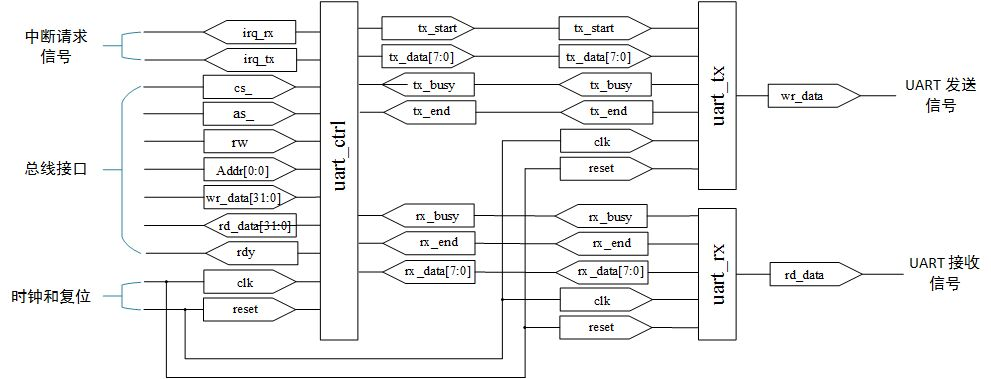

# UART

##UART 的设计

UART 的控制寄存器如表 1-1 所示。

|寄存器编号 |说明       |偏移地址   |访问   |
| :----     | :----     | :----     | :---- |
|0          |控制       |0x0        |读 / 写|
|1          |收发的数据 |0x4        |读 / 写|

###控制寄存器 0 ：状态寄存器

**[0] ：接收完成中断位（RI）**

该位在数据发送完成时被设置为高电平，并同时向 CPU 发送中断请求。

**[1] ：发送完成中断位（TI）**

该位在数据接收完成时被设置为高电平，并同时向 CPU 发送中断请求。

**[2] ：接收中标志位（RB）**

该位在数据接收时为高电平。

**[3] ：发送中标志位（TB）**

该位在数据发送时为高电平。

控制寄存器 0 ：状态寄存器如图 1.1 所示。


###控制寄存器 1 ：收发数据寄存器

**[7:0] ：收发的数据（DATA）**

当向该寄存器写入的数据时，数据会通过 UART 发送。当读取该寄存器时，
会将接收到的数据读取出来。

控制寄存器 1 ：收发数据寄存器如图 1.2 所示。


##UART 的实现

`UART` 由发送模块、接收模块、控制模块，以及进行整体连接的顶层模块构成，如表 1-2 所示，构成关系如图 1.3 所示。

|模块名     |文件名     |说明           |
| :----     | :----     | :----         |
|uart       |uart.v     |UART 顶层模块  |
|uart_tx    |uart_tx.v  |UART 发送模块  |
|uart_rx    |uart_rx.v  |UART 接收模块  |
|uart_ctrl  |uart_ctrl.v|UART 控制模块  |


`UART` 使用的宏一览如表 1-3 所示。

|宏名               | 值    |含义|
|:----              |:----  | :----         |
|UART_DIV_RATE      |9'd260 |分频比率|
|UART_DIV_CNT_W     |9	    |分频计数器位宽|
|UART_DIV_CNT_BUS   |8:0    |分频计数器总线|
|UART_ADDR_BUS      |0:0	|地址总线|
|UART_ADDR_W        |1	    |地址宽|
|UART_ADDR_LOC      |0:0	|地址位置|
|UART_ADDR_STATUS   |1'h0   |控制寄存器 0 ：状态|
|UART_ADDR_DATA     |1'h1   |控制寄存器 1 ：收发的数据|
|UART_CTRL_IRQ_RX   |0	    |接收完成中断|
|UART_CTRL_IRQ_TX   |1	    |发送完成中断|
|UART_CTRL_BUSY_RX  |2	    |接收中标志位|
|UART_CTRL_BUSY_TX  |3	    |发送中标志位|
|UART_STATE_BUS	    |0:0	|状态总线|
|UART_STATE_IDLE    |1'b0   |状态 ：空闲状态|
|UART_STATE_TX	    |1'b1   |状态 ：发送中|
|UART_STATE_RX	    |1'b1   |状态 ：接收中|
|UART_BIT_CNT_BUS   |3:0	|比特计数器总线|
|UART_BIT_CNT_W	    |4      | 比特计数器位宽|
|UART_BIT_CNT_START |4'h0   |计数器值 ：起始位|
|UART_BIT_CNT_MSB   |4'h8   |计数器值 ：数据的 MSB|
|UART_BIT_CNT_STOP  |4'h9   |计时器值 ：停止位|
|UART_START_BIT	    |1'b0   |起始位|
|UART_STOP_BIT	    |1'b1   |停止位|

`UART` 的整体框图如图 1.4 所示。


###发送模块
####实现
发送模块的信号线如表 1-4 所示。

|分组 |信号名 |信号类型 |数据类型 |位宽 |含义|
|:----|:----  | :----|:----|:----  | :----|
|时钟复位|clk |输入端口 |wire |1 |时钟|
|时钟复位|reset |输入端口 |wire |1 |异步复位|
|控制信号|tx_start |输入端口 |wire |1 |发送开始信号|
|控制信号|tx_data |输入端口 |wire |8 |发送的数据|
|控制信号|tx_busy |输出端口 |wire |1 |发送中标志信号|
|控制信号|tx_end |输出端口 |reg |1 |发送完成信号|
|UART 发送信号 |tx |输出端口 |reg |1 |UART |发送信号|
|内部信号|state |内部信号 |reg |1 |发送模块的状态|
|内部信号|div_cnt |内部信号 |reg |9 |分频计数器|
|内部信号|bit_cnt |内部信号 |reg |4 |比特计数器|
|内部信号|sh_reg |内部信号 |reg |8 |发送用移位寄存器|

`uart_tx` 模块代码如下所示。
```
 /********** 发送中标志信号的生成 **********/
   assign tx_busy = ( state == `UART_STATE_TX ) ? `ENABLE : `DISABLE;

   /********** 发送逻辑电路 **********/
   always @(posedge clk or negedge reset) 
      begin
          if (reset == `ENABLE_) 
              begin
                  state <= #1 `UART_STATE_IDLE;
                  div_cnt <= #1 `UART_DIV_RATE;
                  bit_cnt <= #1 `UART_BIT_CNT_START;
                  sh_reg <= #1 `BYTE_DATA_W'b0;   
                  tx_end <= #1 `DISABLE;
                  tx <= #1 `UART_STOP_BIT;
              end
          else  
              begin
                  case(state)
                      `UART_STATE_IDLE: // 空闲状态 
                          begin
                              if(tx_start == `ENABLE)
                                  begin // 开始发送
                                      state <= #1 `UART_STATE_TX;
                                      sh_reg <= #1 tx_data;
                                      tx <= #1 `UART_START_BIT;
                                  end
                              tx_end <= #1 `DISABLE;
                          end
                      `UART_STATE_TX:   // 发送中
                          /* 通过时钟分频调整波特率 */
                          begin
                              if(div_cnt == 9'b0)
                                  begin
                                      /* 发送下一个比特数据 */
                                      case(bit_cnt)
                                          `UART_BIT_CNT_MSB:
                                              begin // 发送停止位
                                                  bit_cnt <= #1 `UART_BIT_CNT_STOP;
                                                  tx <= #1 `UART_STOP_BIT;
                                              end
                                          `UART_BIT_CNT_STOP:
                                              begin // 发送完成
                                                  state <= #1 `UART_STATE_IDLE;
                                                  bit_cnt <= #1 `UART_BIT_CNT_START;
                                                  tx_end <= #1 `ENABLE;
                                              end
                                          default:
                                              begin // 数据的发送
                                                  bit_cnt <= #1 bit_cnt + 1;
                                                  sh_reg <= #1 sh_reg >> 1'b1;
                                                  tx <= #1 sh_reg[`LSB];
                                              end
                                      endcase
                                      div_cnt <= `UART_DIV_RATE;
                                  end
                              else 
                                  begin
                                      div_cnt <= div_cnt - 9'b0_0000_0001;
                                  end
                          end
                  endcase
              end
      end
```
####Testbench

STEP 为一个周期的时间
```
    /********** 生成时钟 **********/
    always #(STEP / 2)
        begin
            clk <= ~clk;  
        end
```
#####初始化信号 (# 0)

*输入信号

|clk |reset |tx_start |tx_data |
|:----|:----  | :----|:----|
|ENABLE|ENABLE_|ENABLE|BYTE_DATA_W'b1110_1101|

*输出信号

|state |div_cnt |bit_cnt |sh_reg|tx_end|tx|
|:----|:----  | :----|:----|:----  | :----|
|UART_STATE_IDLE|UART_DIV_RATE|UART_BIT_CNT_START|BYTE_DATA_W'b0|DISABLE|UART_STOP_BIT|

#####发送信号(#(STEP * (3 / 4 + 2)))

在(#(STEP * (3 / 4 + 2)))时，输入如下信号：

|reset |
|:----|
|DISABLE_|

(#STEP)以后，开始发送信号，输出信号如下：

|tx_busy |tx |tx_end |
|:----|:----  | :----|
|ENABLE|UART_START_BIT|DISABLE|

(#( STEP * ( UART_DIV_RATE + 1 ) ))后第一个比特信号发送完成，输出如下：

|tx |
|:----|
|UART_STOP_BIT|

（#( STEP * ( UART_DIV_RATE + 1 ) )）后第二个比特信号发送完成，输出如下：

|tx |
|:----|
|UART_START_BIT|

###接收模块

####实现

接收模块的信号线如表 1-5 所示。

|分组 |信号名 |信号类型 |数据类型 |位宽 |含义|
|:----|:----  | :----|:----|:----  | :----|
|时钟复位|clk |输入端口 |wire |1 |时钟|
|时钟复位|reset |输入端口 |wire |1 |异步复位|
|控制信号|rx_busy |输出端口 |wire |1 |接收中标志信号|
|控制信号|rx_end |输出端口 |reg |1 |接收完成信号
|控制信号|rx_data|输出端口|reg|8 |接收数据兼移位寄存器|
|UART 接收信号 |rx |输入端口 |wire |1 |UART |接收信号|
|内部信号|state |内部信号 |reg |1 |接收模块的状态|
|内部信号|div_cnt |内部信号 |reg |9 |分频计数器|
|内部信号|bit_cnt |内部信号 |reg |4 |比特计数器|

`uart_rx` 模块代码如下所示。
```
 /********** 接收中标志信号的生成 **********/
 assign rx_busy = (state != `UART_STATE_IDLE) ? `ENABLE :`DISABLE;

 /********** 接收逻辑电路 **********/
 always @(posedge clk or negedge reset) 
      begin
          if (reset == `ENABLE_) 
              begin
                  /* 异步复位 */
                  rx_end <= #1 `DISABLE;
                  rx_data <= #1 `BYTE_DATA_W'b0;
                  state <= `UART_STATE_IDLE;
                  div_cnt <= #1 `UART_DIV_RATE / 2;
                  bit_cnt <= #1 `UART_BIT_CNT_W'b0;           
              end
          else 
              begin
                  case(state)
                      `UART_STATE_IDLE: // 空闲状态
                          begin
                              if(rx == `UART_START_BIT)
                              begin // 接收开始
                                  state <= #1 `UART_STATE_RX;
                              end
                              rx_end <= `DISABLE;
                          end
                      `UART_STATE_RX:
                          begin // 接收中
                              /* 依据时钟分配调整波特率 */
                              if(div_cnt == `UART_DIV_CNT_W'b0)
                                  begin
                                      /* 接收下一个比特数据 */
                                      case(bit_cnt)
                                          `UART_BIT_CNT_STOP:
                                              begin // 接收停止位
                                                  state <= #1 `UART_STATE_IDLE;
                                                  bit_cnt <= #1 `UART_BIT_CNT_START;
                                                  div_cnt <= #1 `UART_DIV_RATE / 2;
                                                  /* 帧错误的检测 */
                                                  if(rx == `UART_STOP_BIT)
                                                      begin
                                                          rx_end <= #1 `ENABLE;
                                                      end
                                              end
                                          default:
                                              begin // 接收数据
                                                  bit_cnt <= #1 bit_cnt + 4'b0001;
                                                  rx_data <= #1 {rx,rx_data[`BYTE_MSB:`LSB+1]};
                                                  div_cnt <= #1 `UART_DIV_RATE;
                                              end
                                      endcase
                                  end
                              else 
                                  begin // 倒数计数
                                      div_cnt <= #1 div_cnt - 9'b0_0000_0001;       
                                  end 
                          end
                  endcase
              end
      end
```
####Testbench

STEP 为一个周期的时间
```
    /********** 生成时钟 **********/
    always #(STEP / 2)
        begin
            clk <= ~clk;  
        end
```
#####初始化信号 (# 0)

*输入信号

|clk |reset |rx |
|:----|:----  | :----|
|ENABLE|ENABLE_|UART_START_BIT|

*输出信号

|rx_end |rx_data|state|div_cnt |bit_cnt |
|:----|:----  | :----|:----|:----  | 
|DISABLE|BYTE_DATA_W'b0|UART_STATE_IDLE|UART_DIV_RATE / 2|UART_BIT_CNT_START|

#####接收信号

在(#(STEP * (3 / 4 + 2)))时，进行信号接收输入如下信号：

|reset |
|:----|
|DISABLE_|

(#STEP)后输出信号如下：

|rx_busy |rx_end |
|:----| :----|
|ENABLE|DISABLE|

(#( STEP * ( UART_DIV_RATE / 2 ) ))后输入接收的第一个比特信号：

|rx |
|:----|
|UART_STOP_BIT|

(#STEP)后接收数据兼移位寄存器的值输出如下：

|rx_data |
|:----|
|BYTE_DATA_W'b1000_0000|

(#( STEP *  UART_DIV_RATE ))后输入接收的第二个比特信号：

|rx |
|:----|
|UART_START_BIT|

(#STEP)后接收数据兼移位寄存器的值输出如下：

|rx_data |
|:----|
|BYTE_DATA_W'b0100_0000|

(#( STEP * ( UART_DIV_RATE * 8 + 7 ) ))后最后一个比特信号接收完成，输出信号如下：

|rx_end |rx_busy |
|:----|:----|:----|
|ENABLE|DISABLE|

###控制模块

####实现

UART 控制模块的信号线一览如表 1-6 所示。

|分组 |信号名 |信号类型 |数据类型 |位宽 |含义|
|:----|:----  | :----|:----|:----  | :----|
|时钟复位|clk |输入端口 |wire |1 |时钟|
|时钟复位|reset|输入端口 |wire |1 |异步复位|
|总线接口|cs_ |输入端口 |wire |1 |片选信号|
|总线接口|as_ |输入端口 |wire |1 |地址选通信号|
|总线接口|rw |输入端口 |wire |1 |读 / 写|
|总线接口|addr |输入端口 |wire |1 |地址|
|总线接口|wr_data |输入端口 |wire |32 |写入的数据|
|总线接口|rd_data |输出端口 |reg |32 |读取的数据|
|总线接口|rdy_ |输出端口 |reg |1 |就绪信号|
|中断 |irq_rx |输出端口 |reg |1 |接收中断请求信号（控制寄存器 0）|
|中断 |irq_tx |输出端口 |reg |1 |发送中断请求信号（控制寄存器 0）|
|控制信号|rx_busy|输入端口|wire |1|接收中标志信号（控制寄存器 0）|
|控制信号|rx_end |输入端口 |wire |1 |接收完成信号|
|控制信号|rx_data |输入端口 |wire |8 |接收的数据|
|控制信号|tx_busy |输入端口 |wire |1 |发送中标志信号（控制寄存器 0）|
|控制信号|tx_end |输入端口 |wire |1 |发送完成信号|
|控制信号|tx_start |输出端口 |reg |1 |发送开始信号|
|控制信号|tx_data |输出端口 |reg |8 |发送的数据|
|控制寄存器 1 |rx_buf |内部信号 |reg 8 |接收用数据缓冲区|

`uart_ctrl` 控制模块代码如下所示。
```
  /********** UART控制逻辑电路 **********/
  always @(posedge clk or negedge reset) 
      begin
          if (reset == `ENABLE_) 
              begin
                  /* 异步复位 */
                  rd_data <= #1 `WORD_DATA_W'b0;
                  rdy_ <= #1 `DISABLE;
                  irq_tx <= #1 `DISABLE;
                  irq_rx <= #1 `DISABLE;
                  tx_start <= #1 `DISABLE;
                  tx_data <= #1 `BYTE_DATA_W'b0;
              end
          else 
              begin
                  /* 就绪信号的生成 */
                  if ((cs_ == `ENABLE_) && (as_ == `ENABLE_))
                      begin
                          rdy_ <= #1 `ENABLE_;
                      end
                  else 
                      begin
                          rdy_ <= #1 `DISABLE_;
                      end
                  /* 读取访问 */
                  if((cs_ == `ENABLE_) && (as_ == `ENABLE_) && (rw == `READ))
                      begin
                          case(addr)
                              `UART_ADDR_STATUS: // 控制寄存器0
                                  begin
                                      rd_data <= #1 {{`WORD_DATA_W-4{ 1'b0 }},tx_busy,rx_busy,irq_tx,irq_rx};
                                  end
                              `UART_ADDR_DATA: // 控制寄存器1
                                  begin
                                      rd_data <= #1 {{`WORD_DATA_W-8{ 1'b0 }},rx_buf};
                                  end
                          endcase
                      end
                  else 
                      begin
                          rd_data <= #1 `WORD_DATA_W'b0;
                      end
                  /* 写入访问 */
                  // 控制寄存器0：发送完成中断
                  if (tx_end == `ENABLE)
                      begin
                          irq_tx <= #1 `ENABLE;
                      end
                  else if ((cs_ == `ENABLE_) && (as_ == `ENABLE_) && (rw == `WRITE) && (addr == `UART_ADDR_STATUS))
                      begin
                          irq_tx <= #1 wr_data[`UART_CTRL_IRQ_TX];
                      end
                  // 控制寄存器0：接收完成中断
                  if (rx_end == `ENABLE)
                      begin
                          irq_rx <= #1 `ENABLE;
                      end
                  else if ((cs_ == `ENABLE_) && (as_ == `ENABLE_) && (rw == `WRITE) && (addr == `UART_ADDR_STATUS))
                      begin
                          irq_rx <= #1 wr_data[`UART_CTRL_IRQ_RX];
                      end
                  // 写入控制寄存器1
                  if ((cs_ == `ENABLE_) && (as_ == `ENABLE_) && (rw == `WRITE) && (addr == `UART_ADDR_DATA))
                      begin // 发送开始
                          tx_start <= #1 `ENABLE;
                          tx_data <= #1 wr_data[`BYTE_MSB:`LSB];
                      end
                  else
                      begin
                          tx_start <= #1 `DISABLE;
                          tx_data <= #1 `BYTE_DATA_W'b0;
                      end
                  /* 接收数据 */
                  if(rx_end == `ENABLE)
                      begin
                          rx_buf <= #1 rx_data;
                      end
              end
      end
```
####Testbench

STEP 为一个周期的时间
```
    /********** 生成时钟 **********/
    always #(STEP / 2)
        begin
            clk <= ~clk;  
        end
```
#####初始化信号 （# 0）

*输入信号

|clk |reset |cs_ |as_|rw|addr|tx_end|tx_busy|rx_busy|rx_data|wr_data|
|:----|:----  | :----|:----  | :----|:----  | :----|:----  | :----|:----  | :----|
|ENABLE|ENABLE_|ENABLE_|ENABLE_|WRITE|UART_ADDR_STATUS|ENABLE|ENABLE|DISABLE|BYTE_DATA_W'b0101_101|WORD_DATA_W'b0101_0101|

*输出信号

|rd_data |rdy_ |irq_tx |irq_rx|tx_start|tx_data|
|:----|:----  | :----|:----  | :----|:----  | 
|WORD_DATA_W'b0|DISABLE|DISABLE|DISABLE|DISABLE|BYTE_DATA_W'b0|

#####控制写入访问

在（#(STEP * (3 / 4 + 2))）时，写入控制寄存器 0，控制发送完成中断，输入如下信号：

|reset |
|:----|
|DISABLE_|

(#STEP)后输出信号如下：

|irq_tx |rdy_ |
|:----| :----|
|ENABLE |ENABLE_|

(#STEP)后输入如下信号，控制发送完成中断：

|tx_end |
|:----|
|DISABLE |

(#STEP)后输出信号如下：

|irq_tx |
| :----|
|DISABLE|

(#STEP)后输入如下信号，控制接收完成中断：

|rx_end |
|:----|
|ENABLE |

(#STEP)后输出信号如下：

|irq_rx |
| :----|
|ENABLE|

(#STEP)后输入如下信号， 写入控制寄存器 1：

|addr |
|:----|
|UART_ADDR_DATA |

(#STEP)后输出信号如下：

|tx_data |tx_start|
| :----|:----|
| BYTE_DATA_W'b0101_0101|ENABLE|

#####控制读取访问

在写入测试完成 (#STEP) 后输入如下信号，读取控制寄存器0：

|rw |addr|
|:----|:----|
|READ |UART_ADDR_STATUS|

(#STEP)后输出信号如下：

|rd_data |
| :----|
|WORD_DATA_W'b0000_1001|

(#STEP) 后输入如下信号，读取控制寄存器1：

|addr |
|:----|
|UART_ADDR_DATA |

(#STEP)后输出信号如下：

|rd_data |
| :----|
|WORD_DATA_W'b0101_1010|

###顶层模块

####实现

`UART` 顶层模块端口连接如图 1.5。



`uart` 顶层模块代码如下所示。
```
  /********** UART 发送模块 **********/
  uart_tx uart_tx(/* 时钟复位信号 */
                  .clk            (clk),            // 时钟
                  .reset          (reset),          // 异步复位
                  /* 控制信号 */
                  .tx_start       (tx_start),       // 发送开始信号
                  .tx_data        (tx_data),        // 发送的数据
                  .tx_busy        (tx_busy),        // 发送中标志信号
                  .tx_end         (tx_end),         // 发送完成信号
                  /* UART 发送信号 */
                  .tx             (tx)              // UART 发送信号
                );
  
  /********** UART 接收模块 **********/
  uart_rx uart_rx(/* 时钟复位 */
                 .clk             (clk),             // 时钟
                 .reset           (reset),           // 异步复位
                 /* 控制信号 */
                 .rx_busy         (rx_busy),         // 接收中标志信号
                 .rx_end          (rx_end),          // 接收完成信号
                 .rx_data         (rx_data),         // 接收数据兼移位寄存器
                 .rx              (rx)               // UART 接收信号
                 );
  
  /********** UART 控制模块 **********/
  uart_ctrl uart_ctrl(
                      /* 时钟复位 */
                      .clk        (clk),             // 时钟
                      .reset      (reset),           // 异步复位
                      /* 总线接口 */
                      .cs_        (cs_),             // 片选信号
                      .as_        (as_),                         // 地址选通信号
                      .rw         (rw),              // 读 / 写
                      .addr       (addr),                        // 地址
                      .wr_data    (wr_data),         // 写入的数据
                      .rd_data    (rd_data),         // 读取的数据
                      .rdy_       (rdy_),            // 就绪信号
                      /* 中断 */
                      .irq_rx     (irq_rx),          // 接收中断请求信号（控制寄存器 0）
                      .irq_tx     (irq_tx),          // 发送中断请求信号（控制寄存器 0）
                      /* 控制信号 */
                      .rx_busy    (rx_busy),         // 接收中标志信号（控制寄存器 0）
                      .rx_end     (rx_end),          // 接收完成信号
                      .rx_data    (rx_data),         // 收的数据
                      .tx_busy    (tx_busy),         // 发送中标志信号（控制寄存器 0）
                      .tx_end     (tx_end),          // 发送完成信号
                      .tx_start   (tx_start),        // 发送开始信号
                      .tx_data    (tx_data)          // 发送的数据
                      );
```

####Teatbench

STEP 为一个周期的时间
```
    /********** 生成时钟 **********/
    always #(STEP / 2)
        begin
            clk <= ~clk;  
        end
```
#####初始化信号 （# 0）

*输入信号

|clk |reset |cs_ |as_|rw|addr|wr_data|rx|
|:----|:----  | :----|:----  | :----|:----  | :----|:----  |
|ENABLE|ENABLE_|ENABLE_|ENABLE_|WRITE|UART_ADDR_DATA|WORD_DATA_W'b1110_1101|UART_START_BIT|

*输出信号

|rd_data |rdy_ |irq_tx |irq_rx|tx_start|tx_data|
|:----|:----  | :----|:----  | :----|:----  | 
|WORD_DATA_W'b0|DISABLE|DISABLE|DISABLE|DISABLE|BYTE_DATA_W'b0|

#####接收发送信号

在（#(STEP * (3 / 4 + 2))）时，接收发送信号，输入如下信号：

|reset |
|:----|
|DISABLE_|

(#STEP * 2)后，开始发送和接收，输出信号如下：

|tx |rdy_ |
|:----| :----|
|UART_START_BIT | ENABLE_|

(#STEP)后，输入接收的比特信号如下：

|rx |
|:----|
|UART_STOP_BIT| 

(#(STEP * UART_DIV_RATE))后，第一个信号发送完成，输出如下：

|tx |
|:----|
|UART_STOP_BIT|

(#STEP)后，对 irq 信号进行测试，输入信号如下：

|rw|addr |
|:----| :----|
|WRITE | UART_ADDR_STATUS|

(#STEP)后，输出信号如下：

|irq_rx |irq_tx|
|:----|
|ENABLE|DISABLE |

(#(STEP * (UART_DIV_RATE / 2 + UART_DIV_RATE * 8))）后，接收信号完成，准备读出接收的信号，输入信号如下：

|rw|addr |
|:----| :----|
|READ |UART_ADDR_DATA|

(#(STEP * 8)）后，读出接收的信号,输出如下：

|rd_data|
|:----|
|WORD_DATA_W'b1111_1111|
